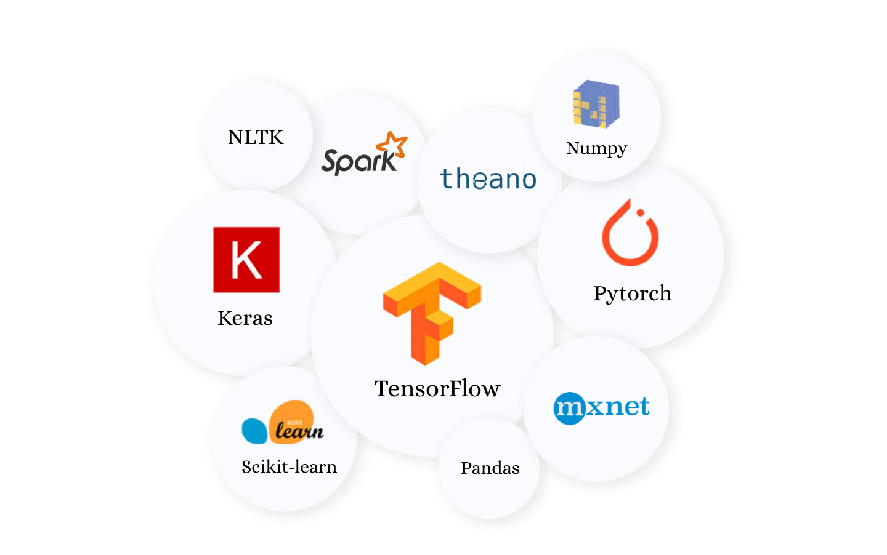

## Learn  Python

### Python Machine Learning
* numpy
* pandas - este o bibliotecă software scrisă pentru limbajul de programare Python pentru manipularea și analiza datelor.
* matplotlib
* scipy
* sklearn

|Program    | Resurse externe                                                   | Resursele mele                           |
|-----------|-------------------------------------------------------------------|------------------------------------------|
| Python    | [Python](https://www.python.org/)                                 |[01python.ipynb](00_python.ipynb)         |
|           | [Tutorialspoint](https://www.tutorialspoint.com/python/index.htm) |                                          |
|           |                                                                   |                                          |
| IPython   |[IPython](https://ipython.org/install.html)                        |[02_ipython.ipynb](02_ipython.ipynb)      |
|           .|                                                                   |                                         |
|Numpy      | [Numpy](https://numpy.org/)                                       |[03_numpy.ipynb](03_numpy.ipynb)          |
|           |                                                                   |                                          |
|Pandas     | [Pandas](https://pandas.pydata.org/docs/index.html)               |[04_pandas.ipynb](04_pandas.ipynb)        |
|           |                                                                   |                                          | 
|Matplotlib |[Matplotlib](https://matplotlib.org/)                              |[05_matplotlib.ipynb](05_matplotlib.ipynb)|
|           |                                                                   |                                          |
|Scikit-Learn|[Scikit-learn](https://scikit-learn.org/stable/)                  |[07_scikit.ipynb](07_scikit.ipynb)        |

### Machine learning map (https://github.com/trekhleb/homemade-machine-learning)

#### Linear regression
- [15_linear_regression.ipynb](15_linear_regression.ipynb)
- [19_LR_stock_predict.ipynb](19_LR_stock_predict.ipynb)
- [20_liniar_regression.ipynb](20_liniar_regresion.ipynb)

## Translating
× [27_translate-checkpoint.ipynb](27_translate-checkpoint.ipynb)

### Web scraping

BeautifulSoup   
+ [09_beautifulsoup.ipynb](09_beautifulsoup.ipynb)
+ [10_beautifulsoup.ipynb](10_beautifulsoup.ipynb)
+ [11_beautifulsoup.ipynb](11_beautifulsoup.ipynb)
+ [14_wikipedia.ipynb](14_wikipedia.ipynb)
+ [18_BeautifulSoup.ipynb](18_BeautifulSoup.ipynb)
+ [29_Weather_forecast.ipynb](29_Weather_forecast.ipynb)

Requests
+ [21_wsj_rss.ipynb](21_wsj_rss.ipynb)
+ [35_cnn.ipynb](35_cnn.ipynb)

Ipywidgets
+ [22_ipywidgets.ipynb](22_ipywidgets.ipynb)
+ [23_image.ipynb](23_image.ipynb)
+ [24_gmaps.ipynb](24_gmaps.ipynb)
+ [25_video.ipynb](25_video.ipynb)

### Analiza Bursiera
- [40_liniar_regression.ipynb](40_liniar_regression.ipynb)
- [34_BollingerBands.ipynb](34_BollingerBands.ipynb)
- [42_financial_analysis.ipynb](42_financial_analysis.ipynb)
- [28_SimpleStockCharts.ipynb](28_SimpleStockCharts.ipynb)

### Analiza actiuni

- Boeing (BA)   [06_Boeing.ipynb](06_Boeing.ipynb)
- Facebook (FB) [12_Facebook.ipynb](12_Facebook.ipynb)
                [16_Facebook.ipynb](16_Facebook.ipynb)
                
- [37_American_Airlines.ipynb](37_American_Airlines.ipynb)
- [41_microsoft.ipynb](41_microsoft.ipynb)
- [43_aur.ipynb](43_aur.ipynb)
                
### Analiza CryptoCurrency
- [ETHER USD](33_ETHUSD.ipynb)
- [39_bitcoin.ipynb](39_bitcoin.ipynb)
- [31_bitcoin_rolling_returns.ipynb](31_bitcoin_rolling_returns.ipynb)
- [30_etherium](30_etherium.ipynb)

## Machine learning
- [32_autocorrelation.ipynb](32_autocorrelation.ipynb)

## Maps
* [36_maps.ipynb](36_maps.ipynb)
* [38_openBrowser.ipynb](38_openBrowser.ipynb)

### Download pdf
* [13_pdf_download.ipynb](13_pdf_download.ipynb)
* [17_search_pdf.ipynb](17_search_pdf.ipynb)

### Books
- [machine_learning_with_python_tutorial.pdf](machine_learning_with_python_tutorial.pdf)
- [python_machine_learning.pdf](python_machine_learning.pdf)

## Open in:

